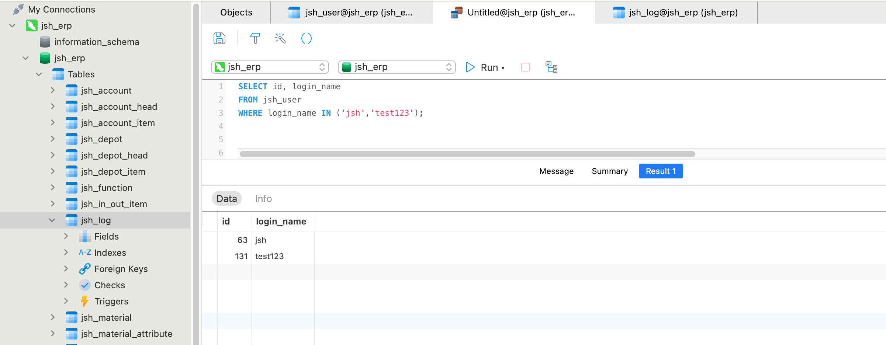
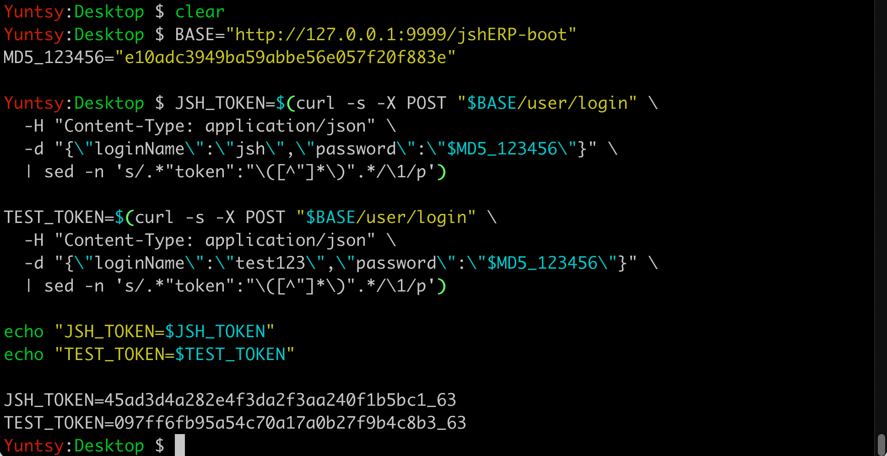
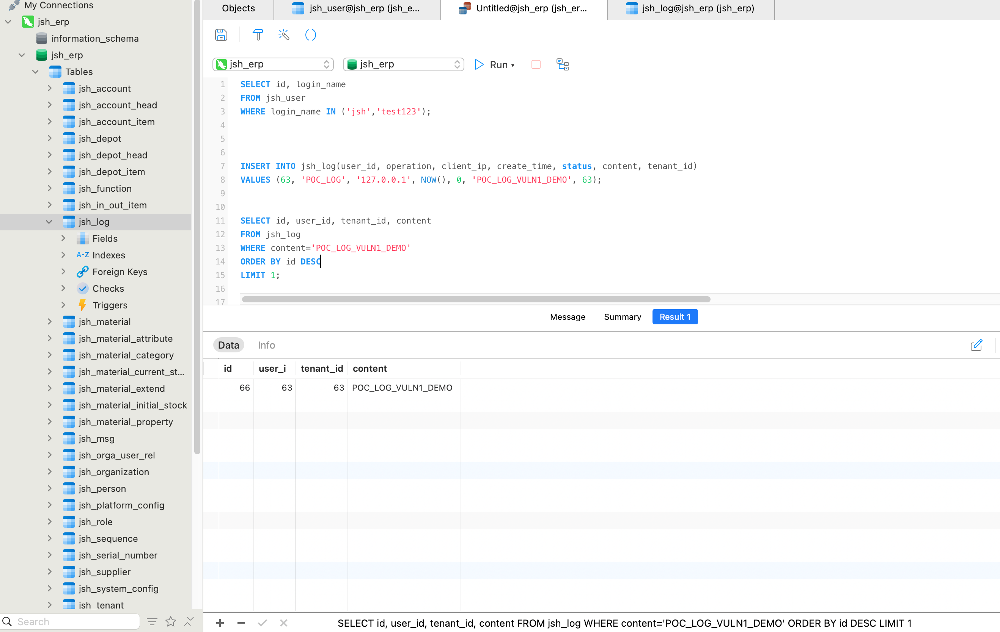
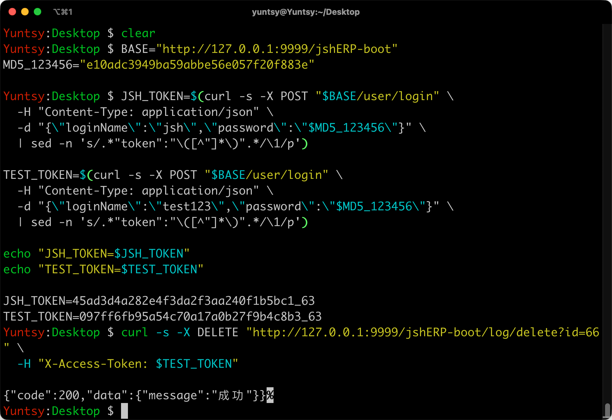
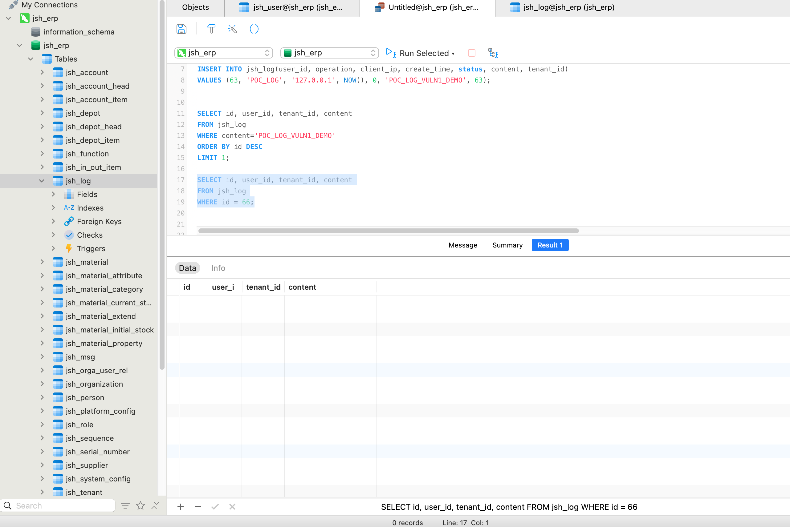

确认当前存在账户的ID

我们先后登陆两个账户，获取对应的Token

接下来给id=63，也就是jsh用户插入一条日志

这里的日志id是66，记录下来

接下来使用test123的token删除id为66的日志

接口响应成功，在数据库中查看

日志成功被删除

属于用户jsh的日志被用户test123删除。

危害：攻击者可以遍历日志id删除数据库中存在的所有日志

给用户jsh创建消息

使用test123的token删除这条消息

响应成功

在数据库中查询

消息被删除

用户test123删除了用户jsh的消息